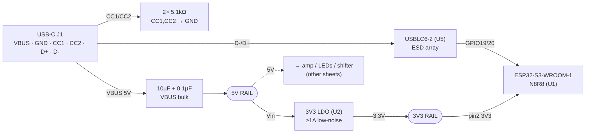

# Block 1 — MCU + Power + USB

The foundation sheet: USB-C 5 V in → 3V3 rail → ESP32-S3 module, plus native USB
and reset/boot. Draw this KiCad sheet only after reviewing against the datasheets
listed at the bottom and the breadboard.

## Connection diagram



## USB-C connector (J1) — net table

| Pin(s) | Net | Connection |
|---|---|---|
| VBUS (A4/A9/B4/B9) | +5V | → VBUS bulk (10 µF + 0.1 µF) → 5V rail |
| GND (A1/A12/B1/B12) | GND | ground pour |
| CC1 (A5) | CC1 | → 5.1 kΩ → GND (sink advertisement) |
| CC2 (B5) | CC2 | → 5.1 kΩ → GND |
| D+ (A6/B6) | USB_D+ | → USBLC6-2 → ESP32 **GPIO20** |
| D- (A7/B7) | USB_D- | → USBLC6-2 → ESP32 **GPIO19** |
| SBU1/2, extra D± | — | no connect |
| SHIELD | GND | to GND (optionally via 1 MΩ ∥ 4.7 nF) |

> Dumb 5 V source: 5.1 kΩ CC pull-downs are all that's needed — no PD negotiation.
> Native USB (D±) gives you flashing + USB-CDC logs; keep the ESD array right at J1.

## 3V3 LDO (U2) — net table

| Pin | Net | Connection |
|---|---|---|
| VIN | +5V | from 5V rail; input cap 1 µF (per datasheet) |
| EN | +5V | tie to VIN (always-on) |
| GND | GND | |
| VOUT | +3V3 | **22–47 µF bulk** + 0.1 µF → 3V3 rail |

> **Why not AMS1117:** the S3 pulls WiFi-TX bursts up to ~0.5 A on 3V3, stacked on
> mic + sensor + e-ink. Spec a low-noise ≥1 A LDO (AP7361-33 / TLV75901 / RT9080-33)
> with generous output bulk to ride the bursts. Amp + mic reference this rail's quiet.

## ESP32-S3-WROOM-1 (U1) — key pins

| Module pin | Net | Connection |
|---|---|---|
| GND (1, 40, thermal pad) | GND | pour + vias under pad |
| 3V3 (2) | +3V3 | **22 µF bulk + 0.1 µF at the pin** |
| EN (3) | EN | reset RC — see below |
| GPIO0 (27) | IO0 | boot strap — see below |
| GPIO19 (30) | USB_D- | from USBLC6-2 |
| GPIO20 (31) | USB_D+ | from USBLC6-2 |
| TXD0/RXD0 (37/36 = GPIO43/44) | UART | optional debug header / test points |
| all other GPIO | — | go to their peripheral sheets (see master pin map) |

## Reset (EN) and Boot (IO0) circuits

```
   3V3                         3V3 (module has internal IO0 pull-up;
    │                           add external 10k if you want margin)
   10kΩ                         │
    │                          [10kΩ]        ← optional
    ├──────── EN (module)       │
   ═╪═ 1µF                      ├──── IO0 (GPIO0)
    │         [EN button]      ═╪═ 0.1µF      ← debounce (optional)
   GND ───────┘ to GND          │
                               [BOOT button] to GND
                                │
                               GND
```

- **EN:** 10 kΩ pull-up + 1 µF to GND (power-on reset delay) + momentary button to GND.
- **IO0/BOOT:** idles HIGH; held LOW at reset = download mode. Standard dual-use as the
  boot button *and* the firmware "VA button." **Must be HIGH at boot** — do not add a
  strong pull-down.
- Bring **EN, IO0, TX, RX, 3V3, 5V, GND** to test points/header for recovery + flashing.

## Antenna keep-out

WROOM-1 PCB antenna must overhang the board edge with a **ground/copper keep-out**
under and around it, per Espressif's ESP32-S3 Hardware Design Guidelines. No traces,
pour, or parts in the antenna zone.

## Cross-check before drawing

- **Espressif ESP32-S3-WROOM-1 datasheet** — module pinout / pin numbers above.
- **Espressif ESP32-S3-DevKitC-1 schematic (PDF)** — canonical USB-C, EN RC, IO0, LDO
  wiring. Your breadboard is a DevKitC, so this is the closest 1:1 reference.
- **ESP32-S3 Hardware Design Guidelines** — antenna keep-out, power decoupling.
- **USBLC6-2SC6 datasheet** — ESD array pinout/orientation.
- **Chosen LDO datasheet** — exact in/out cap values + thermal.
- **Breadboard:** confirm you're powering the DevKit via 5 V and that native-USB
  logging (GPIO19/20) is what you've been using — matches this sheet.
